<br />

<div align="center">
  <a href="https://github.com/etherealxx/batchlinks-downloader">
    
  </a>

<h3 align="center">BatchLinks Downloader</h3>

<p align="center">
    Batch-downloading models and stuff in stable-diffusion-webui colab made simple and fast.
    <br />
    <a href="https://github.com/etherealxx/batchlinks-downloader"><strong></strong></a>
    <br />
    <a href="https://github.com/etherealxx/batchlinks-downloader/issues">Report Bug</a>
    ·
    <a href="https://github.com/etherealxx/batchlinks-downloader/discussions/new?category=ideas">Request Feature</a>
  </p>

</div>

<!-- TOC -->
<!-- - [Installation](#installation)
- [About](#about)
- [Example](#example)
- [Syntax](#syntax)
    - [Hashtag](#hashtag)
    - [Links](#links)
    - [Double Hashtag](#double-hashtag)
    - [Others](#others)
  - [Valid Hashtags](#valid-hashtags)
  - [How to get the direct links (Important!)](#how-to-get-the-direct-links-important)
  - [Huggingface's download method](#huggingfaces-download-method)
- [Additional Syntax](#additional-syntax)
  - [Rename Downloaded Files](#rename-downloaded-files)
  - [Running Shell Commands](#running-shell-commands)
  - [Extract Everyting (`@extract`)](#extract-everyting-extract)
  - [Custom Hashtag Path (`@new`)](#custom-hashtag-path-new)
  - [Custom Direct Link Download with `aria2` (`@aria2`)](#custom-direct-link-download-with-aria2-aria2)
- [Gradio Queue](#gradio-queue)
  - [Logging](#logging)
  - [Cancel](#cancel)
  - [Progress Bar](#progress-bar)
  - [Changes if `--gradio-queue` is off](#changes-if---gradio-queue-is-off)
- [Other Features](#other-features)
  - [Notification](#notification)
  - [Copy From Pastebin](#copy-from-pastebin)
  - [SDless mode](#sdless-mode)
  - [Local Installation Support](#local-installation-support)
  - [Debug Mode (Developer only)](#debug-mode-developer-only)
- [Release Notes](#release-notes)
- [Roadmap](#roadmap)
- [Known Bugs](#known-bugs)
  - [Known Fixed Bugs](#known-fixed-bugs)
- [Contributing](#contributing)
- [Contact](#contact)
- [Acknowledgments](#acknowledgments) -->
<!-- /TOC -->

<details>
  <summary>Table of Contents</summary>
  <ol>
    <li><a href="#installation">Installation</a></li>
    <li><a href="#about">About</a></li>
    <li><a href="#example">Example</a></li>
    <li><a href="#syntax">Syntax</a></li>
        <ul><li><a href="#hashtag">Hashtag</a></li></ul>
        <ul><li><a href="#links">Links</a></li></ul>
        <ul><li><a href="#double-hashtag">Double Hashtag</a></li></ul>
        <ul><li><a href="#others">Others</a></li></ul>
      <ul><li><a href="#valid-hashtags">Valid Hashtags</a></li></ul>
      <ul><li><a href="#how-to-get-the-direct-links-important">How to get the direct links (Important!)</a></li></ul>
      <ul><li><a href="#huggingfaces-download-method">Huggingface's download method</a></li></ul>
    <li><a href="#additional-syntax">Additional Syntax</a></li>
      <ul><li><a href="#rename-downloaded-files">Rename Downloaded Files</a></li></ul>
      <ul><li><a href="#running-shell-commands">Running Shell Commands</a></li></ul>
      <ul><li><a href="#extract-everyting-extract">Extract Everyting (`@extract`)</a></li></ul>
      <ul><li><a href="#custom-hashtag-path-new">Custom Hashtag Path (`@new`)</a></li></ul>
      <ul><li><a href="#custom-direct-link-download-with-aria2-aria2">Custom Direct Link Download with `aria2` (`@aria2`)</a></li></ul>
    <li><a href="#gradio-queue">Gradio Queue</a></li>
      <ul><li><a href="#logging">Logging</a></li></ul>
      <ul><li><a href="#cancel">Cancel</a></li></ul>
      <ul><li><a href="#progress-bar">Progress Bar</a></li></ul>
      <ul><li><a href="#changes-if---gradio-queue-is-off">Changes if `--gradio-queue` is off</a></li></ul>
    <li><a href="#other-features">Other Features</a></li>
      <ul><li><a href="#notification">Notification</a></li></ul>
      <ul><li><a href="#copy-from-pastebin">Copy From Pastebin</a></li></ul>
      <ul><li><a href="#sdless-mode">SDless mode</a></li></ul>
      <ul><li><a href="#local-installation-support">Local Installation Support</a></li></ul>
      <ul><li><a href="#debug-mode-developer-only">Debug Mode (Developer only)</a></li></ul>
    <li><a href="#release-notes">Release Notes</a></li>
    <li><a href="#roadmap">Roadmap</a></li>
    <li><a href="#known-bugs">Known Bugs</a></li>
      <ul><li><a href="#known-fixed-bugs">Known Fixed Bugs</a></li></ul>
    <li><a href="#contributing">Contributing</a></li>
    <li><a href="#contact">Contact</a></li>
    <li><a href="#acknowledgments">Acknowledgments</a></li>
    </li>
  </ol>
</details>

[does this repo still maintained?](https://github.com/etherealxx/batchlinks-webui/blob/main/regardingthisrepo.md)

## Installation

Copy this line into your colab installation cell. Or into a new cell if you already launched the webui.

```
!git clone https://github.com/etherealxx/batchlinks-webui /content/stable-diffusion-webui/extensions/batchlinks-webui
```

or, you can copy the url of this repo and install it via webui and restart the UI.<br/>
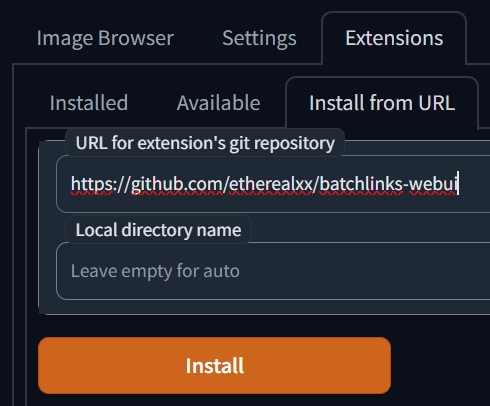<br/>
(If `gradio no interface is running` or `bad gateway` shows up when restarting the UI, that means you need to restart the cell anyway 😅)

<!--
or, if your colab use the newer version of webui (gradio version above 3.16.0) you can use this instead (it adds a little progress bar)

```
!git clone -b gradio-v3-16-2 https://github.com/etherealxx/batchlinks-webui /content/stable-diffusion-webui/extensions/batchlinks-webui
```
-->

Using `--gradio-queue` on the launch.py argument is highly recommended, as it enables this extension to show download progress bar on the UI and a cancel button. The option itself has no negative effect on the webui. [Read more here.](https://github.com/etherealxx/batchlinks-webui#gradio-queue)<br/>
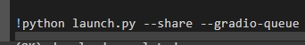<br/>

You can also run this extension in [SDless mode](https://github.com/etherealxx/batchlinks-webui#sdless-mode) btw.

While it's not recommended to use this extension on your local installation, you can use this extension on Windows. [More here.](https://github.com/etherealxx/batchlinks-webui#local-installation-support)

## About

This extension will streamline your downloads on your [stable-diffusion-webui](https://github.com/AUTOMATIC1111/stable-diffusion-webui) colab session. Paste the links you need to download (or you can upload a txt file containing the links), use the hashstag syntax to choose the download location (see below), and hit the `Download All` button to download them!

## Example

Look at this example<br/>
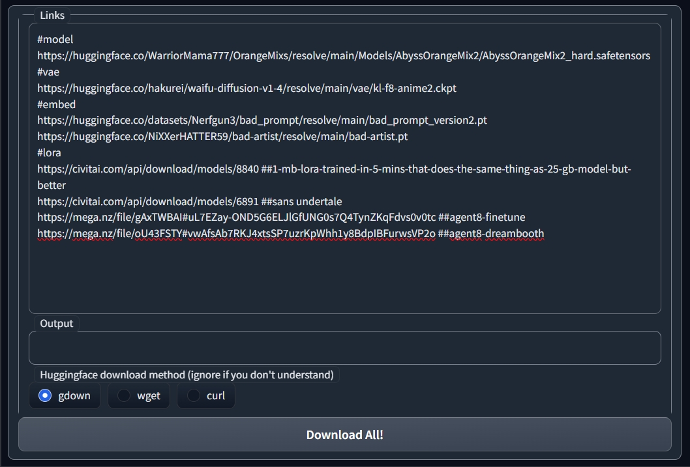<br/>

```
#model
https://huggingface.co/WarriorMama777/OrangeMixs/resolve/main/Models/AbyssOrangeMix3/AOM3_orangemixs.safetensors
#vae
https://huggingface.co/hakurei/waifu-diffusion-v1-4/resolve/main/vae/kl-f8-anime2.ckpt
#embed
https://huggingface.co/datasets/Nerfgun3/bad_prompt/resolve/main/bad_prompt_version2.pt
https://huggingface.co/etherealxx/whoseisthis/resolve/main/bad_artist.pt
#lora
https://civitai.com/api/download/models/8840 ##1-mb-lora-trained-in-5-mins-that-does-the-same-thing-as-25-gb-model-but-better
https://civitai.com/api/download/models/6891 ##sans undertale
https://mega.nz/file/gAxTWBAI#uL7EZay-OND5G6ELJlGfUNG0s7Q4TynZKqFdvs0v0tc ##agent8-finetune
https://mega.nz/file/oU43FSTY#vwAfsAb7RKJ4xtsSP7uzrKpWhh1y8BdpIBFurwsVP2o ##agent8-dreambooth
#hypernet
https://cdn.discordapp.com/attachments/1070489470127841381/1070489471964954684/MomopocoV3.pt
```

This piece of lines will be read from top to bottom. Every hashtag, it will change the current output directory to said directory (see below). So what this example do is it will download `AOM3` model to the model folder, then it will download the vae and put it to the Vae folder. Next it will download two embed, `bad prompt` and `bad artist`. Next it will download several LoRAs from CivitAI and MEGA, and put it to the Lora folder. Lastly, it changes the directory to hypernet directory, then 

You can also copy that example and paste it to a `.txt` file to use later. You can load a `.txt` file containing that piece of lines directly from the UI.

When the items is downloading, you can inspect the running code on the colab cell, or just take a coffee and chill☕. If you activate logging, you can inspect the download progress from the UI, more [here](https://github.com/etherealxx/batchlinks-webui#logging)

When the download is complete, the downloaded file will be listed<br/>
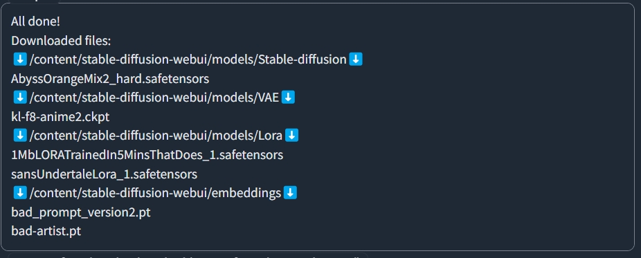<br/>

## Syntax

#### Hashtag 
- Hashtag means change current output directory to this directory. `#model` means every links below this hashtag, will be downloaded to _/content/stable-diffusion-webui/models/Stable-diffusion_, until it hits another hashtag, which will change the output directory again. See [below](https://github.com/etherealxx/batchlinks-webui#valid-hashtags) for valid hashtags.

  Note: If you use some colab that purposefully uses `sd-webui-additional-networks` extension to load Lora, use `#addnetlora` instead of `#lora`. It will download the lora to where it supposed to be.

#### Links
- Links are the main things you wants to be downloaded. Current supported links are from:
  - Huggingface (https://huggingface.co/)
  - MEGA (https://mega.nz/) {using `mega-cmd`}
  - CivitAI (https://civitai.com/)
  - Discord attachments (https://cdn.discordapp.com/attachments/)
  - catbox (https://files.catbox.moe)
  - Github (https://github.com or https://raw.githubusercontent.com)
  - Google Drive (https://drive.google.com) {using `gdown`}
  - Pixeldrain (https://pixeldrain.com/u/)
  - Mediafire (https://www.mediafire.com/file) {using `mediafire-dl`}
  - anonfiles (https://anonfiles.com)

  Every links other than that will be ignored. Keep in mind the only supported links are direct download links (see [here](https://github.com/etherealxx/batchlinks-downloader/blob/main/howtogetthedirectlinks.md)). For Huggingface, Civitai (model page link method), Discord attachments, catbox, pixeldrain, and anonfiles, there will be four different method of downloading offered (see [below](https://github.com/etherealxx/batchlinks-webui#huggingfaces-download-method)). For MEGA, it will use `mega-cmd` to download. For Github, if, the link is a raw file, it will download the file. Else, it will use `git clone`, useful to clone extension repo into the webui extension folder.

  More about CivitAI download method [here](https://github.com/etherealxx/batchlinks-webui#civitais-download-method).

#### Double Hashtag
- Double hashtag means comment. You can put double hashtag in the same line of the link and it will be ignored (keep in mind to put the link first then the double hashtag)

#### Others
- Other texts will be ignored.

### Valid Hashtags

`#model`, `#models`, `#checkpoint`, or `#checkpoints` will put the downloaded file to _/content/stable-diffusion-webui/models/Stable-diffusion_

`#embedding`, `#embeddings`, `#embed`, `#embeds`, `#textualinversion`, or `#ti` will put the downloaded file to _/content/stable-diffusion-webui/embeddings_

`#vae` or `#vaes` will put the downloaded file to _/content/stable-diffusion-webui/models/VAE_

`#hypernetwork`, `#hypernetworks`, `#hypernet`, `#hypernets`, `#hynet`, or `#hynets` will put the downloaded file to _/content/stable-diffusion-webui/models/hypernetworks_

`#lora` or `#loras` will put the downloaded file to _/content/stable-diffusion-webui/models/Lora_

`#addnetlora`, `#loraaddnet`, `#additionalnetworks`, or `#addnet` will put the downloaded file to _/content/stable-diffusion-webui/extensions/sd-webui-additional-networks/models/lora_

`#aestheticembedding` or `#aestheticembed` will put the downloaded file to _content/stable-diffusion-webui/extensions/stable-diffusion-webui-aesthetic-gradients/aesthetic_embeddings_

`#controlnet` or `#cnet` will put the downloaded file to _/content/stable-diffusion-webui/extensions/sd-webui-controlnet/models_

`#upscale` or `#upscaler` will put the downloaded file to _/content/stable-diffusion-webui/models/ESRGAN_

`#lycoris`, `#locon`, or `#loha` will put the downloaded file to _/content/stable-diffusion-webui/extensions/sd-webui-additional-networks/models/lora/lycoris_

`#altmodel` or `#altmodels` will put the downloaded file to the path you choose when using `--ckptdir` argument on `launch.py` line. If you didn't use that argument, this hashtag will points to the same directory as `#model`

_Lycoris/Locon/Loha_ will works just fine if you use `#addnetlora` instead, as long as you have both [addnet extension](https://github.com/kohya-ss/sd-webui-additional-networks) and [locon extension](https://github.com/KohakuBlueleaf/a1111-sd-webui-locon) installed. It's unclear if it's can be loaded by native auto1111 lora. (Tell me if you know more about this.)

Github links (if it does not contain `/raw/` or `/release/download/` in it) doesn't need hashtag. It will always considered as webui extension, and the repository will be cloned to _/content/stable-diffusion-webui/extensions/(reponame)_

### How to get the direct links (Important!)

See [here](https://github.com/etherealxx/batchlinks-downloader/blob/main/howtogetthedirectlinks.md)

### Huggingface's download method

So there's four supported method: `gdown`, `wget`, `curl` and `aria2`. Use whatever, really. The difference between them are actually little. Myself love using `gdown` since the output is cleaner than the others. `aria2` has the fastest download speed though.

<!-- ### Civitai's download method

There are two ways to download links from Civit. The `model page link` method, and the `direct link` method.

The `model page link` method **will automatically** choose the directory of the saved model without even using hashtag. It will download the default model of a model page. The advantage of this method is you will also get the model preview images that can shows up on the latest version of [stable-diffusion-webui](https://github.com/AUTOMATIC1111/stable-diffusion-webui). This method will also uses the same download protocol as huggingface's (see above). <br/>The `model page link` method's link starts with **https://civitai.com/models/**

The `direct link` method is the old method, which needs hashtag for the downloaded model to be properly placed, and uses `request` module to download. The advantage of this method is you can choose what model variation you want to download by grabbing the right url. See [here](https://github.com/etherealxx/batchlinks-downloader/blob/main/howtogetthedirectlinks.md) for more.<br/>The `direct link` method's link starts with **https://civitai.com/api/download/models/**

Here's the difference of syntax between two methods:

Model page link:
```
https://civitai.com/models/4823/deliberate
```
Direct link:
```
#model
https://civitai.com/api/download/models/5616
```

Check [this page](https://github.com/etherealxx/batchlinks-downloader/blob/main/howtogetthedirectlinks.md) to learn more on how to get the links for each methods. -->

## Additional Syntax
### Rename Downloaded Files
Using `>` symbol, you can rename files. Take this for example<br/>
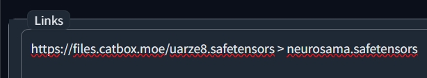<br/>
Mostly catbox file has random name, by using `>` symbol after the link, you can type the desired name on the right. (Don't forget the extension)

### Running Shell Commands
You can run shell commands by using `!` in front of the command you want, just like in google colab cells. Then press the `Download All!` button. (Sure, it doesn't download anything, but, well😅)<br/>
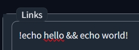
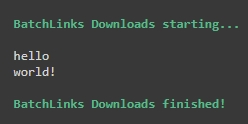<br/>
You can run many lines at once too!

### Extract Everyting (`@extract`)
You can use `@extract` to extract every `*.7z`, `*.rar`, and `*.zip` on current directory). 
```
#lora
<example lora .zip link>
@extract
#embed
```
This will extract everything on Lora folder, since the code runs from top to bottom, and when the `@extract` executes, the current directory is still on Lora folder.

### Custom Hashtag Path (`@new`)
You can use `@new <hashtagname> <directory>` to make a new usable hashtag and assign a directory path to it.<br/>For example, you type this and press the `Download All!` button:
```
@new #private /content/stable-diffusion-webui/outputs
#private
<example model link>
```
This will make a new hashtag `#private`, make it points to _/content/stable-diffusion-webui/outputs_, set `#private` as current directory, then download whatever into it. You can check if the new hashtag is assigned successfully by looking at the hashtag table on the right/bottom of the screen.

### Custom Direct Link Download with `aria2` (`@aria2`)
If there are other direct links that isn't supported by Batchlinks, you can use `@aria` or `@aria2` custom command to download it. The main syntax is:
```
@aria2 {link} {path/hashtag} > {filename} 
```
You can change `@aria2` with `@aria`, both works. Both the `path/hashtag` and `filename` is optional. This command was made to avoid hassle writing this:
```
aria2c --summary-interval=1 --console-log-level=error -c -x 16 -s 16 -k 1M {link} -d {path} -o {filename}
```
There are several ways to use it. Here i use a [20MB download test file](http://212.183.159.230/20MB.zip) as an example.
```
@aria2 http://212.183.159.230/20MB.zip
```
☝️ This will download the file into the current directory (where the hashtags points to). So if before that line you use `#vae`, it will be downloaded to the vae directory. If there are no hashtags before, it'll be sent to the default `#model` directory. The filename will be the last part of the link (`512MB.zip`).
```
@aria2 http://212.183.159.230/20MB.zip #vae
```
☝️ This will download the file into where `#vae` points to (which is the vae directory). You can use custom hashtag here as well.
```
@aria2 http://212.183.159.230/20MB.zip /content/stable-diffusion-webui 
```
☝️ This will download the file into the written path, which is _/content/stable-diffusion-webui_. Make sure it is a folder path, not a file path.
```
@aria2 http://212.183.159.230/20MB.zip /content/stable-diffusion-webui > 20megabytes.zip
```
☝️ This will download the file into the written path and rename the file into `20megabytes.zip`. Remember to make sure to write the extension too.

## Gradio Queue

If you use --gradio-queue argument on `launch.py`, some feature will be activated.

### Logging

<!-- If you use latest version of [stable-diffusion-webui](https://github.com/AUTOMATIC1111/stable-diffusion-webui), or webui forks that supports `--gradio-queue` args on launch.py, use it and you will be able to -->
Enable logging by pressing the `Turn On Logging` radio button, and wait till `Logging activated` shows up and the box is blinking with orange border. Logging will tell you what are you actually downloading right now on the webui. After your download session is completed, it's recommended to turn back off the feature.<br/>
<br/>

### Cancel 
Pressing `cancel` button while download in progress will stops the current session. Useful when at one time the download speeds is too slow. If you're currently downloading a single item, that item will be cancelled, but the other downloaded one will remain intact.<br/>
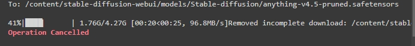<br/>

### Progress Bar
There will be an additional progress bar that tells you the current activities.<br/>
<br/>

### Changes if `--gradio-queue` is off
Feature listed above will dissapear, and your only option for download is just `aria2` (speed is priority).<br/>Note that when you pressed the `Download All!` button, **nothing will shows up on the UI**. You need to check the colab console.<br/>
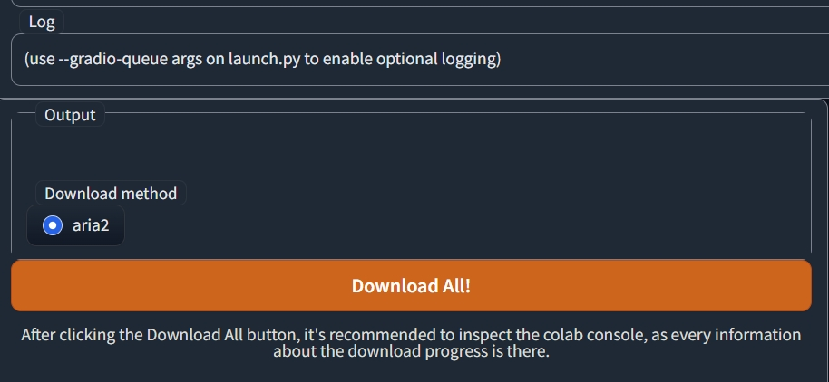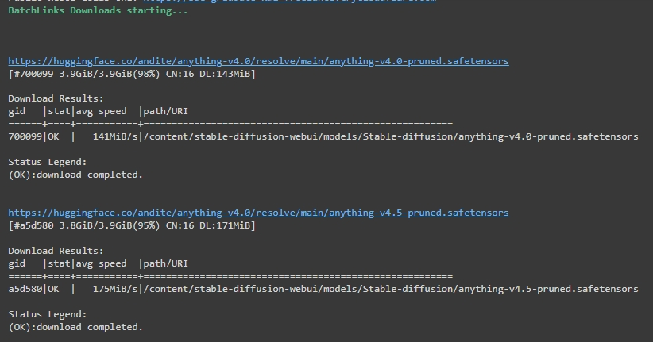<br/>
Another thing to note is your download session will always be cutted every 70 seconds (to prevent hangs/desync).<br/>
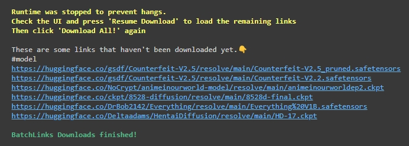<br/>
Don't worry, you can continue your session by pressing the `Resume Download` button. It will refresh the links with the one you haven't downloaded yet, then pressing `Download All!` will download the remaining links.<br/>
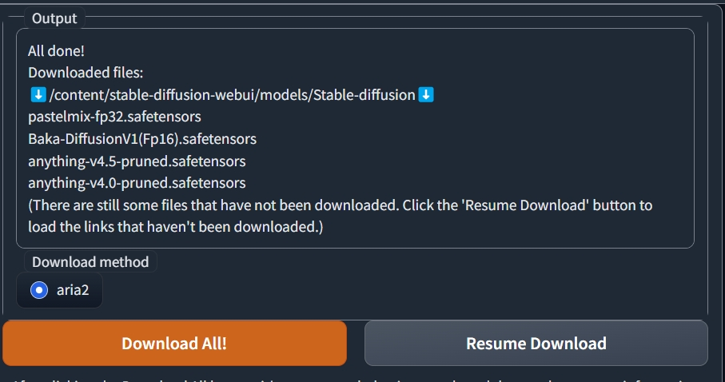<br/>

## Other Features

### Notification

This extension will play sound effect when the download process is completed. It's somewhat buggy at the moment though.

### Copy From Pastebin

You can put your links on pastebin (write it the way you wrote on Batchlinks), put the pastebin link (https://pastebin.com/xxxx) on the link input, and press the 'Copy from Pastebin' button. It will copy all the the links on the pastebin to the UI. Useful to avoid hassle copy and pasting a bunch of text while on mobile.<br/>
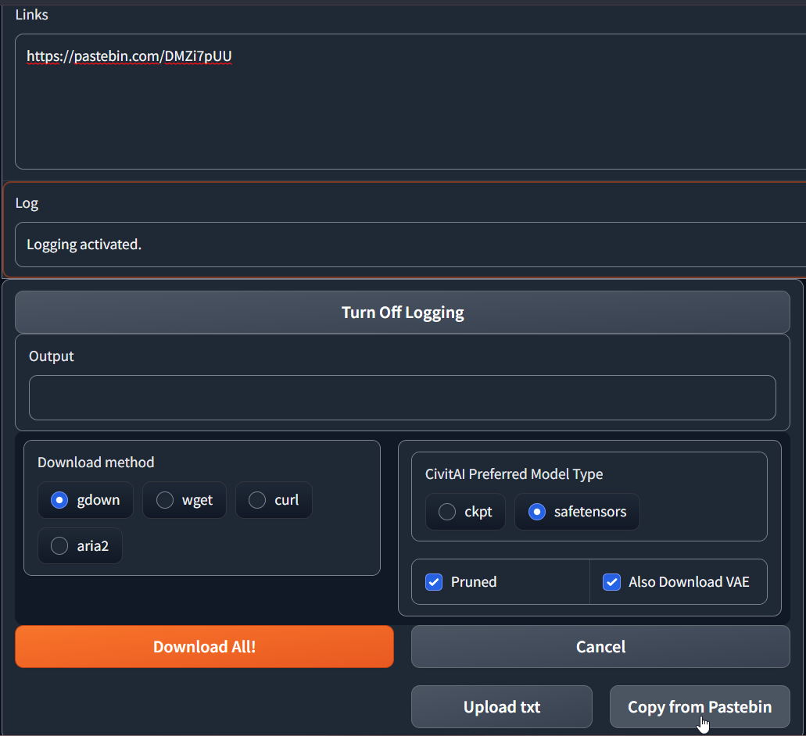<br/>

### SDless mode
This mode will run the extension without the need of stable-diffusion-webui. Good for my own purpose of debugging it😁.<br/>
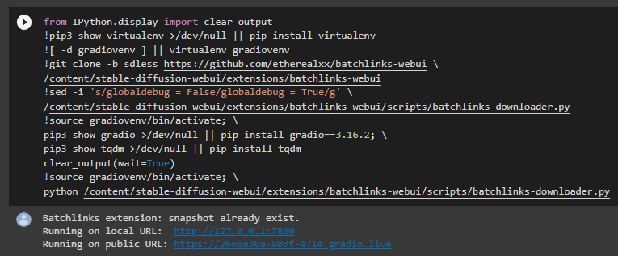<br/>

Copy-paste this on a new colab cell then run it:
```
from IPython.display import clear_output
!pip3 show virtualenv >/dev/null || pip install -q virtualenv
![ -d gradiovenv ] || virtualenv gradiovenv
!git clone https://github.com/etherealxx/batchlinks-webui \
/content/stable-diffusion-webui/extensions/batchlinks-webui
pip3 show gradio >/dev/null || pip install -q gradio==3.16.2; \
pip3 show tqdm >/dev/null || pip3 install -q tqdm
clear_output(wait=True)
!source gradiovenv/bin/activate; \
python /content/stable-diffusion-webui/extensions/batchlinks-webui/scripts/batchlinks-downloader.py
```
or here's the quicker version without venv:
```
!pip install gradio==3.16.2
!git clone https://github.com/etherealxx/batchlinks-webui /content/stable-diffusion-webui/extensions/batchlinks-webui
!python /content/stable-diffusion-webui/extensions/batchlinks-webui/scripts/batchlinks-downloader.py
```

For Windows, run the sdless-windows.bat. Make sure you have `python3` and `gradio` package version 3.16.2 or above. It won't use venv.

This one for MacOS. Tested on Mojave. Create a shell script and give execute access to it.
```
#!/usr/bin/env bash
pip3 show virtualenv >/dev/null || pip3 install virtualenv
[ -d gradiovenv ] || virtualenv gradiovenv
git clone https://github.com/etherealxx/batchlinks-webui \
$HOME/Downloads/stable-diffusion-webui/extensions/batchlinks-webui
source gradiovenv/bin/activate; \
pip3 show gradio >/dev/null || pip3 install gradio==3.16.2; \
pip3 show tqdm >/dev/null || pip3 install -q tqdm
source gradiovenv/bin/activate; \
python3 $HOME/Downloads/stable-diffusion-webui/extensions/batchlinks-webui/scripts/batchlinks-downloader.py
```

### Local Installation Support

This extension was tested to work on Windows 11. But ultimately, the number one priority for me is colab use, so there's might be bugs on Windows 11 one. Maybe also works on Debian-based linux (but you better inspect the source code first).
On Windows, this extension will install [MEGAcmd](https://github.com/meganz/MEGAcmd) for MEGA file download, [wget-windows](https://github.com/webfolderio/wget-windows) for download using `wget`, [aria2-static-builds](https://github.com/q3aql/aria2-static-builds) for download using `aria2`, [7zr and 7z](https://www.7-zip.org) for extracting `aria2` installation, and for `@extract` command.
MacOS is just partially supported.

Also remember, in order for this extension to work properly, you need make sure that you tick that `add Python 3.10 to PATH` checkbox when you installed Python (Which is already recommended when installing stable-diffusion-webui)<br/>
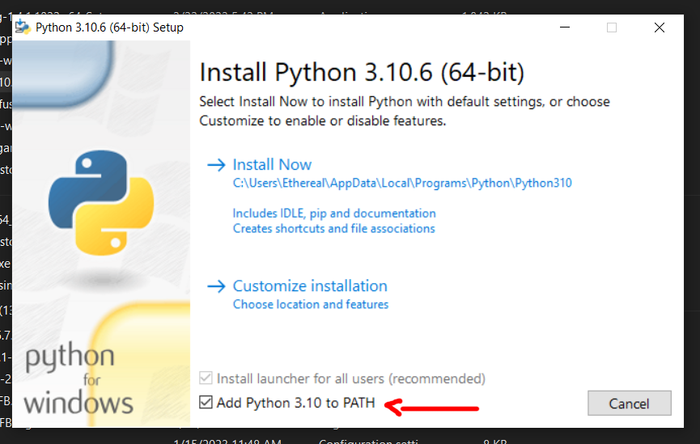<br/>

### Debug Mode (Developer only)

By manually switching `globaldebug = False` to `True` on the source code, or using `--debug` argument when running the sdless mode, the Debug Mode will be activated. It shows every `print` calls i use to track variables. It will also tracks every files on the models (etc.) paths into a `snapshot.txt` file (if there isn't one).

There are some batchlinks syntax features that only available on debug mode (putting it on the textbox and click `Download All!`):

`@debugresetdownload` - This command will check every model (etc.) directory, and remove every file that isn't on `snapshot.txt`. Useful for me to removes file quickly when testing. **Be careful using this on your local installation.**

`@debugresetdownload` - This command is (supposed to) download a single link with every method available (gdown, curl, wget, aria2), but now i rarely use this command, and haven't updated since. Might be buggy.

## Release Notes
Moved [here](https://github.com/etherealxx/batchlinks-webui/blob/main/releasenotes.md). Check it out for latest features & bug fixes.

## Roadmap

- [ ] Add checker for downloaded models (so that it won't download again after the model is downloaded)
- [ ] Different UI for mobile
- [ ] Gradio progress bar
- [ ] Integrating refresh button (`create_refresh_button`) to refresh models etc. all at once
- [ ] Logo change
- [ ] Moving most of the content of this `Readme.md` to Wiki instead
- [ ] Other download sites (s-ul.eu, gitgud, bunkr.ru, icedrive)
- [ ] Separate 'download' and 'run command' function with a subtab
- [ ] Support download MEGA and Google Drive folder
- [ ] Using `yield` instead of gradio's `every`
- [ ] Youtube video (Tutorial)
- [ ] (Crawler) Download every sd-webui related file from a huggingface repo
- [ ] (Crawler) Download every model from a civitai user page
<br/>_
- [x] aria2 for huggingface download method
- [x] Cleaning the code from unnecesarry comments
- [x] Completed download will use the webui's notification.mp3
- [x] Support customizable hashtag from the UI
- [x] Supports Windows local installation
- [x] UI overhaul
- [x] Using threading/subprocess instead of os.system to download files
- [x] (Windows) wget & aria2 support

## Known Bugs

- Progress bar (the yellow bar) doesn't progress as expected
- Sometimes notification sound doesn't play when downloading same file twice in a row
- Sometimes notification sound shows up when starting download, instead of when the download process is completed.
- There's still a chance that the UI of non `--gradio-queue` session and/or onedotsix freezes after a download session
- Windows: The delay between file is downloaded and the output shows is pretty long, and even sometimes the notification comes at the wrong time.
<br/>

### Known Fixed Bugs

<details>
  <summary>👈Fixed Bugs</summary>
  <ol>
    <ul>
      <li><s>Links that has bracket in it needs to be 'escaped' (For example, <code>Baka-DiffusionV1(Fp16).safetensors</code> must be typed <code>Baka-DiffusionV1\(Fp16\).safetensors</code>)</s><br/>☝️Fixed in <a href="dbb2adb3d07e41654244076b8ef4e851c3bb1f0c">v2.0.0</a>
      <li><s>The delay between file is downloaded and the output shows is really long (1min+) on <a href="https://github.com/camenduru/stable-diffusion-webui-colab">camenduru's v1.6 colab</a> (Gradio related?)</s><br/>☝️Seems like fixed in <a href="fe6feafc07fbbe3efd2883b33855f8d66b5f89ea">v1.1.0</a>
      <li><s>File downloaded from MEGA will not listed on the output, as it use different download method. There is some delay between the transfare() function complete until it writes the file. I don't know how long the delay is.</s><br/>☝️Fixed in <a href="fe6feafc07fbbe3efd2883b33855f8d66b5f89ea">v1.1.0</a>
      <li><s>Sometimes colab cannot be shut down with a single click on the stop button. Hitting the button several times will raise a KeyboardInterrupt and forcely stopping the cell.</s><br/>☝️Seems like fixed somewhere on <a href="0acffad539179b9f6cf4b76581818b62c93a8551">v3.0.0</a> and after
    </ul>
  </ol>
</details>

## Contributing

<!-- I just learned python few months ago, by just looking at other peoples project and sometimes asking ChatGPT. Gradio is new for me. I literally just learn it in one day to make this extension, so expect some bugs. -->

[I no longer actively maintain this project](https://github.com/etherealxx/batchlinks-webui/blob/main/regardingthisrepo.md). if you have a suggestion or code-fixing that would make this better, please notify me in the issue tab, fork the repo and create a pull request. <br/>
But still, a star on this project would be nice. Thanks again.

<!--
1. Fork the Project
2. Create your Feature Branch (`git checkout -b feature/AmazingFeature`)
3. Commit your Changes (`git commit -m 'Add some AmazingFeature'`)
4. Push to the Branch (`git push origin feature/AmazingFeature`)
5. Open a Pull Request

<p align="right">(<a href="#readme-top">back to top</a>)</p>
-->

## Contact

My Email - gwathon3@gmail.com <br/>
My Youtube - [MJ Devlog](https://www.youtube.com/@mjdevlog)

## Acknowledgments

- [Camenduru's Webui Huggingface](https://github.com/camenduru/stable-diffusion-webui-huggingface) - I use his extension as my base (my gradio skill sucks T.T)
- [SD Civitai Browser](https://github.com/Vetchems/sd-civitai-browser) - Civit download script
- [Mega-to-Google-Drive](https://github.com/menukaonline/Mega-to-Google-Drive) - MEGA download script
- [MEGAcmd](https://github.com/meganz/MEGAcmd)
- [mediafire-dl](https://github.com/Juvenal-Yescas/mediafire-dl)
- [Pixeldrain downloader](https://github.com/FayasNoushad/Pixeldrain) - Inspiration for Pixeldrain download method
- [wget-windows](https://github.com/webfolderio/wget-windows)
- [aria2-static-builds](https://github.com/q3aql/aria2-static-builds)
- [7zr, 7z](https://www.7-zip.org)
